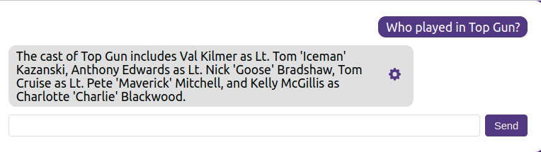

# Langchain2Neo4j

_Cypher search is now part of the official LangChain library: https://towardsdatascience.com/langchain-has-added-cypher-search-cb9d821120d5 _



The Langchain2Neo4j is a proof of concept application of how to integrate Neo4j into the Langchain ecosystem.
This project took heavy inspiration from [IMDB-LLM](https://github.com/ibiscp/LLM-IMDB).
The IMDB-LLM integrated graph search using networkx library into langchain ecosystem.
I borrowed the idea and changed the project to use Neo4j as the source of information for the LLM.

The project now supports three modes of context search:

* Generating Cypher statements to query the database
* Full-text search of relevant entities
* Vector similarity search

Learn more: https://towardsdatascience.com/integrating-neo4j-into-the-langchain-ecosystem-df0e988344d2

## Neo4j database

The project uses the [Recommendation project](https://sandbox.neo4j.com/?usecase=recommendations) that is available as part of the Neo4j Sandbox.
If you want a local instance of Neo4j, you can restore a database dump that is available [here](https://github.com/neo4j-graph-examples/recommendations/tree/main/data).

## Installation and Setup

1. Create a `.env` file and fill-in the environment variables as shown in the `env.example`

2. You need to create a full text index and import the movie embeddings: 

```bash
sh seed_db.sh
```

If you are using Windows, you can also execute the code in `data/database_seed.ipynb` notebook to seed the database.

3. Run the project using docker-compose

```bash
docker-compose up
```

7. Open the application in your browser at http://localhost:3000

## Example questions
```
# Who played in Top Gun?
MATCH (m:Movie)<-[r:ACTED_IN]-(a)
RETURN {{actor: a.name, role: r.role}} AS result
# What is the plot of the Copycat movie?
MATCH (m:Movie {{title: "Copycat"}})
RETURN {{plot: m.plot}} AS result
# Did Luis Guzmán appear in any other movies?
MATCH (p:Person {{name:"Luis Guzmán"}})-[r:ACTED_IN]->(movie)
RETURN {{movie: movie.title, role: r.role}} AS result
# Do you know of any matrix movies?
MATCH (m:Movie)
WHERE toLower(m.title) CONTAINS toLower("matrix")
RETURN {{movie:m.title}} AS result
```
